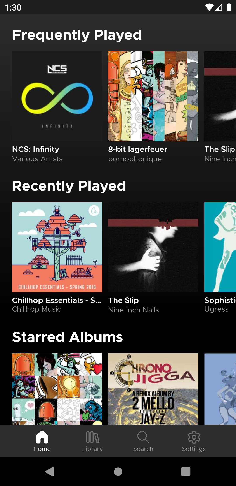

# 
Subtracks is an Android open source music streaming app for [Subsonic-API-compatible](http://www.subsonic.org/pages/api.jsp) servers ([Subsonic](http://www.subsonic.org/pages/index.jsp), [Navidrome](https://www.navidrome.org/), [Airsonic](https://airsonic.github.io/), and more).  It's designed to give you clean and convenient access to your music in the style of modern media players.

# Screenshots

  
  
  
  

# Download

  
  

> :warning: Note: each download source above is signed with a different key, so you cannot switch between them without first uninstalling and then re-installing the app.

# Features
- Album and artist art display by default (full-res in detail/now playing views)
- Gapless playback
- Mulitple server support
- Filterable/sortable album and artist library views
- Search artists, albums, and songs
- Scrobble support
- Max bitrate and buffer size settings
- Loop and shuffle playback options
- Long-press for context menu shortcuts

# Coming Soon™
- Offline support
- Customizable home screen categories
- Browse by folder support (currently only browses by tags)
- Multiple music folder awareness
- By year/by genre albums filter
- Playlist mangement (add/remove/sort/edit)
- Queue management (add/remove/sort)
- Multi-select actions
- Performance & animation improvements
