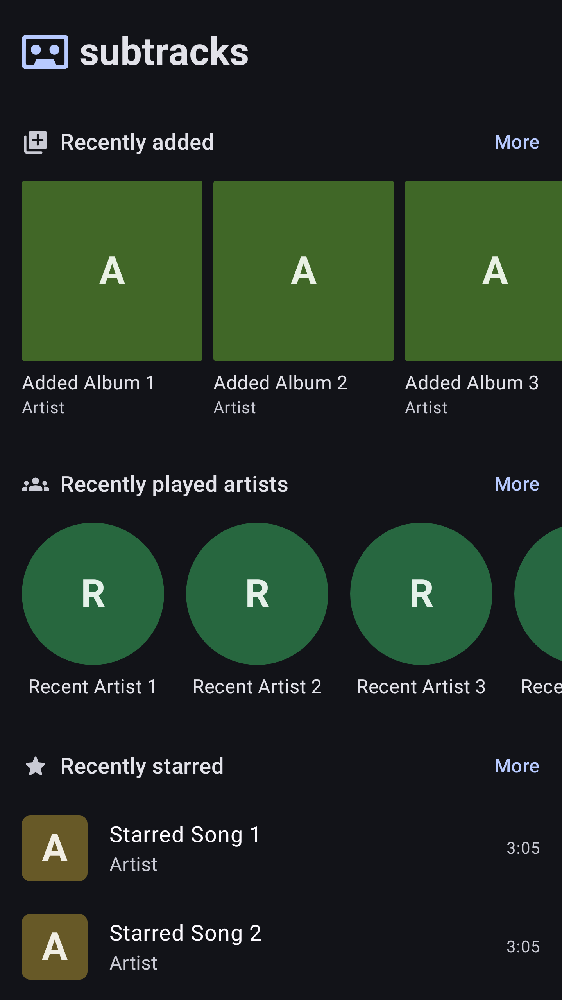
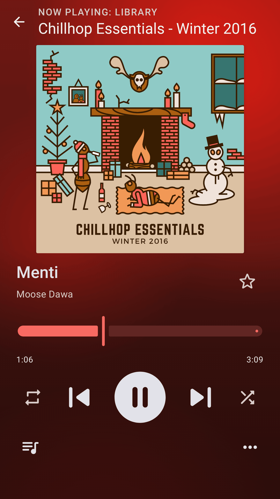
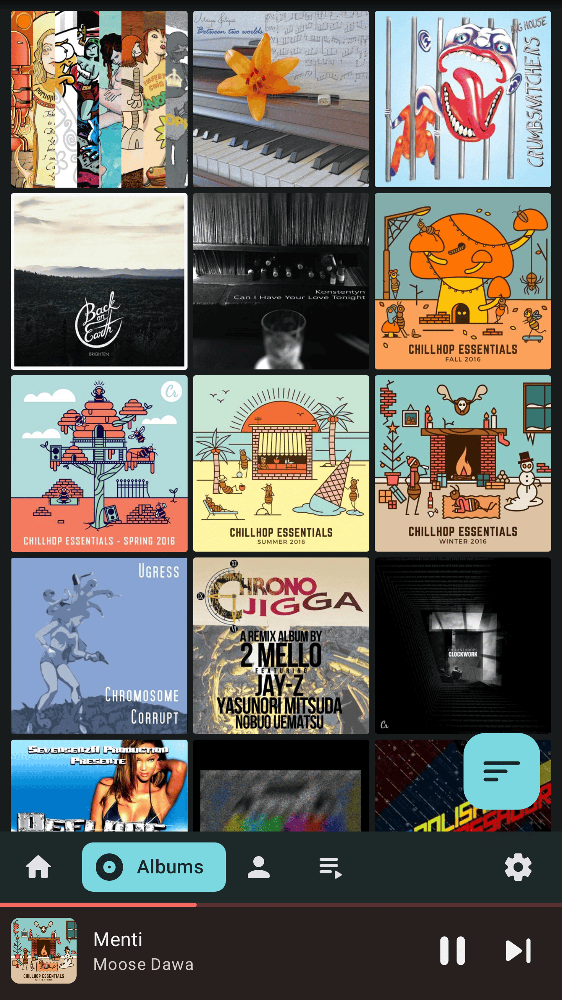
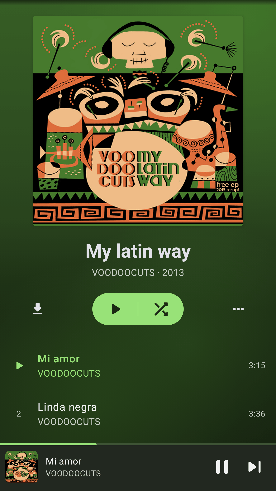
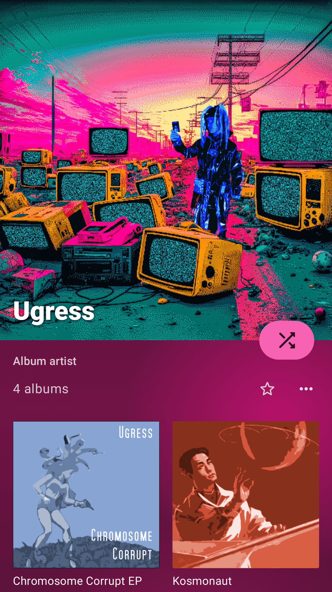

<h1> subtracks</h1>

[](https://github.com/austinried/subtracks/releases/latest/)
[](https://github.com/austinried/subtracks/releases/)
<a href="https://hosted.weblate.org/engage/subtracks/"></a>
[](LICENSE)

subtracks is an open source Android client for [Subsonic-compatible](http://www.subsonic.org/pages/api.jsp) servers ([Navidrome](https://www.navidrome.org/), [gonic](https://github.com/sentriz/gonic), [LMS](https://github.com/epoupon/lms), [Nextcloud Music](https://apps.nextcloud.com/apps/music) and more). It is written natively in Kotlin and Jetpack Compose and gives you clean, convenient access to your music in the style of a modern media player.

## Screenshots

<div align="center">
  <a href="metadata/en-US/images/phoneScreenshots/01_home.png"></a>
  <a href="metadata/en-US/images/phoneScreenshots/02_now-playing.png"></a>
  <a href="metadata/en-US/images/phoneScreenshots/03_library-albums.png"></a>
  <a href="metadata/en-US/images/phoneScreenshots/04_album.png"></a>
  <a href="metadata/en-US/images/phoneScreenshots/05_artist.png"></a>
</div>

## Download

<div align="center">
  <a href="https://play.google.com/store/apps/details?id=com.subtracks"></a>
  <a href="https://f-droid.org/en/packages/com.subtracks/"></a>
  <a href="https://github.com/austinried/subtracks/releases/"></a>
</div>

## Features

- Home screen to browse your library over many categories, genres, and more
- Album and artist artwork, shown full-resolution in the detail and now playing views
- Downloads with album, artist and playlist bulk downloads, download quality and a metered-connection toggle
- Search across albums, artists, playlists and songs, with per-list sort and filter controls
- Gapless playback, an editable queue you can reorder and jump through, and loop and shuffle modes
- Up next queue to add items into the currently playing queue without rewriting it
- Multiple server support with quick switching
- Stream quality (bitrate and format) settings for Wi-Fi and mobile and automatic switching
- Scrobbling and starred items, cached while offline and sent back to the server when online
- Media notification and headset/Bluetooth controls
- Adaptive theming from the current song's artwork

The full library is mirrored at sync, so browsing, searching, sorting and filtering all work without waiting on the server. Only media and artwork are fetched on demand, and not even that when they're already downloaded.

## Building

The project's entire toolchain is provided by a Nix flake. The default devshell provides JDK, Gradle and the Android SDK, so there is nothing to install by hand.

Therefore, to get started, you'll need to install Nix. I prefer [Lix](https://lix.systems/install/).

```sh
nix develop
gradle :app:assembleDebug
```

Test, lint and screenshot commands, plus the integration harness, are documented in [AGENTS.md](AGENTS.md). The architecture is described in [docs/architecture.md](docs/architecture.md).

## Translations

Want to see subtracks in your language? Visit the project on [Weblate](https://hosted.weblate.org/engage/subtracks/) to help!

<a href="https://hosted.weblate.org/engage/subtracks/">

</a>

## AI usage disclosure

This project contains code and documentation generated by LLM, which is created via human prompting, iteration and review.

## License

subtracks is free software, licensed under the [GNU General Public License v3.0](LICENSE). It has no ads and no telemetry, and uses only free/libre dependencies.
